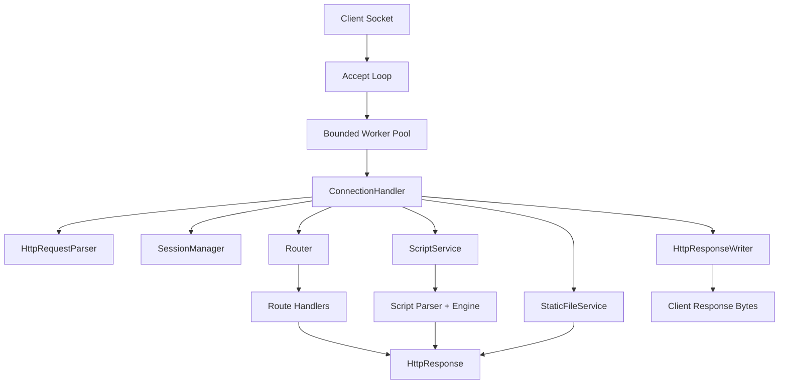

# SimpleHttpServer

An educational HTTP server that demonstrates, in plain Java, how a server handles:

1. TCP accept loop and connection handling
2. HTTP request parsing and response serialization
3. URL routing and parameter extraction
4. Static file serving with path traversal protection
5. Server-side scripting (custom educational language) and templating

This repository modernizes a legacy academic project into a clean Maven structure while preserving the original teaching goals.

## Project Status

- Java version: **17**
- Build tool: **Maven**
- Dependencies: **minimal** (JUnit only for tests)
- Runtime framework: **none** (no Spring, no heavy server framework)

## Quick Start

### 1) Build and test

```bash
mvn clean test
```

### 2) Package runnable JAR

```bash
mvn clean package
```

### 3) Run server (default config from classpath)

```bash
java -jar target/simple-http-server-2.0.0-SNAPSHOT.jar
```

Type `stop` + Enter in the terminal to stop the server.

### 4) Run with external config override (optional)

```bash
java -jar target/simple-http-server-2.0.0-SNAPSHOT.jar /absolute/path/to/server.properties
```

## Example Requests

```bash
curl -i http://127.0.0.1:5721/
curl -i http://127.0.0.1:5721/hello
curl -i "http://127.0.0.1:5721/echo?x=1&x=2&name=Alice"
curl -i "http://127.0.0.1:5721/template?name=Bob"
curl -i http://127.0.0.1:5721/scripts/basic.smscr
curl -i http://127.0.0.1:5721/scripts/fibonacci.smscr
curl -i http://127.0.0.1:5721/users/42
```

## Maven Layout

```text
src/main/java        -> server implementation
src/main/resources   -> config, static files, scripts, templates
src/test/java        -> unit + integration tests
docs                 -> architecture and implementation guides
```

## Configuration

Default file: `src/main/resources/server.properties`

| Key | Meaning | Default |
|---|---|---|
| `server.host` | Bind address | `127.0.0.1` |
| `server.port` | Bind port (`0` = random) | `5721` |
| `server.workerThreads` | Worker thread count | `8` |
| `server.queueCapacity` | Bounded request queue size | `64` |
| `server.socketTimeoutMillis` | Read timeout per socket | `5000` |
| `server.maxHeaderBytes` | Max header size | `16384` |
| `server.maxBodyBytes` | Max request body size | `1048576` |
| `session.timeoutSeconds` | Inactivity timeout for sessions | `600` |
| `server.publicResourcesRoot` | Classpath root for static files | `public` |
| `server.templatesRoot` | Classpath root for templates | `templates` |
| `server.mimeTypesResource` | MIME map resource file | `mime-types.properties` |

## Built-in Educational Routes

- `GET /hello` -> plain text `Hello World`
- `GET /echo?x=1` -> JSON echo of path + query params
- `GET /template?name=Alice` -> template rendering demo with session visit counter
- `GET /scripts/basic.smscr` -> script language demo (lexer + parser + engine)
- `GET /scripts/fibonacci.smscr` -> script language + temporary parameters demo
- `GET /scripts/callcount.smscr` -> script language + persistent session params demo
- `GET /users/{id}` -> path-parameter routing demo
- `GET /` -> static `index.html`

## Architecture Overview



## How Routing Works

Register routes in `com.example.simplehttpserver.app.DefaultRoutes`:

```java
router.addRoute(HttpMethod.GET, "/users/{id}", context ->
    HttpResponse.json(HttpStatus.OK,
        "{\"userId\":\"" + JsonUtil.escape(context.pathParam("id").orElse("unknown")) + "\"}")
);
```

## How Templating Works

Template syntax is intentionally minimal:

```html
<p>Hello, {{name}}</p>
<p>Visit count: {{visits}}</p>
```

`TemplateService` loads template files from `src/main/resources/templates` and replaces `{{key}}` placeholders from a model map.

## How Scripting Works (`.smscr`)

The legacy educational scripting language is restored with explicit components:

- `ScriptDocumentLexer`: splits source into text blocks and tags (`[$ ... $]`)
- `TagLexer`: tokenizes content inside tags
- `ScriptParser`: builds AST (`FOR`, `END`, and `=`/echo tags)
- `ScriptEngine`: executes AST using stack-based expression evaluation

Supported script constructs:

- Text blocks outside tags
- `[$ FOR var start end step $] ... [$END$]`
- `[$= ... $]` echo tags using RPN expressions
- Functions: `@sin`, `@decfmt`, `@dup`, `@setMimeType`, `@paramGet`, `@pparamGet`, `@pparamSet`, `@pparamDel`, `@tparamGet`, `@tparamSet`, `@tparamDel`

Script files are loaded from `src/main/resources/public` and executed when URL path ends with `.smscr`.

## Security and Robustness Basics Included

- Header size and body size limits
- Socket read timeout
- `Content-Length` validation
- Basic `405 Method Not Allowed` with `Allow` header
- Path traversal protection for static resources
- Simple in-memory session handling with `HttpOnly` SID cookie
- Explicit 4xx/5xx error responses for parse and runtime failures

## Limitations (Intentional)

This is an educational server, not a production-grade HTTP implementation.

Not implemented intentionally:

- TLS/HTTPS
- HTTP/2 or HTTP/3
- Chunked request body parsing
- Keep-alive connection reuse (responses are `Connection: close`)
- Multipart form data parsing
- Advanced caching/compression
- Persistent/distributed sessions

## Changes from Legacy Version

1. Migrated from Ant/Eclipse layout to **Maven Java 17** project structure.
2. Replaced monolithic server class with explicit components:
   - `SimpleHttpServer` (accept loop + executor)
   - `ConnectionHandler` (per-request pipeline)
   - `HttpRequestParser` and `HttpResponseWriter`
   - `Router`, `SessionManager`, `StaticFileService`, `TemplateService`
3. Package namespace changed from legacy `hr.fer.zemris.java.*` to `com.example.simplehttpserver.*`.
4. Reintroduced the legacy-style smart script functionality with a modernized implementation:
   - explicit lexer
   - parser
   - AST
   - runtime engine
5. Added clear tests for HTTP parsing/routing/response serialization, script lexer/parser/engine, and integration endpoints.
6. Rewrote documentation in English and expanded with a structured `docs/` guide set.

### Migration Note

If you had code importing old legacy packages, update imports to new package names and route API:

- Old: `hr.fer.zemris.java.webserver.*`
- New: `com.example.simplehttpserver.*`

## Documentation Index

- `docs/01_architecture.md`
- `docs/02_http_basics.md`
- `docs/03_request_parsing.md`
- `docs/04_routing.md`
- `docs/05_scripting_or_templating.md`
- `docs/06_static_files.md`
- `docs/07_extending.md`
- `docs/08_testing.md`
