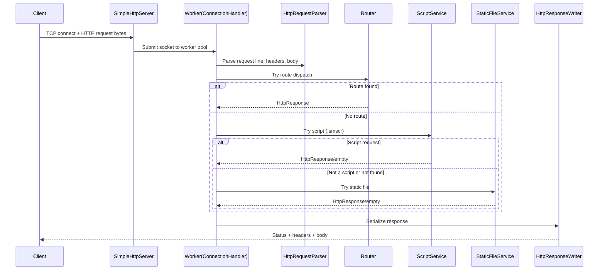

# 01 Architecture

## Goals

The architecture is intentionally explicit so students can follow the full HTTP lifecycle without framework abstraction.

## Main Components

- `SimpleHttpServer`: owns server socket, accept loop, and bounded worker pool.
- `ConnectionHandler`: handles exactly one client socket.
- `HttpRequestParser`: converts bytes into an `HttpRequest` object.
- `Router`: matches method + path patterns to handlers.
- `SessionManager`: creates/refreshes in-memory sessions from `SID` cookie.
- `ScriptService`: loads `.smscr` resources and runs script execution pipeline.
- `ScriptParser` + `ScriptEngine`: parse and execute the custom scripting language.
- `StaticFileService`: serves classpath static files and blocks path traversal.
- `HttpResponseWriter`: serializes status line, headers, and body bytes.

## Request Lifecycle

## Concurrency Model

- One accept thread.
- Bounded `ThreadPoolExecutor` for request handling.
- If queue is full, server responds with `503 Service Unavailable`.

Why this model:

- Easy to understand compared to event loops.
- Safe enough for small educational load.
- Demonstrates backpressure via bounded queue.

## Error Handling Strategy

- Parse failures return structured 4xx/5xx responses.
- Runtime exceptions in handlers return `500 Internal Server Error`.
- Socket timeouts return `408 Request Timeout`.
